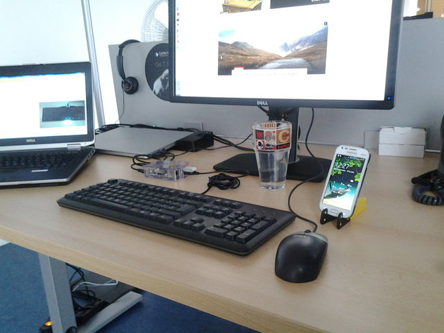

# usbkb2bt - Bluetooth Keyboard Emulation with a Raspberry Pi

This README describes usage of the standard Raspbian Jessie version 8.   

Jessie installs bluez5, which is sometimes problematic for pairing and connection. See the other README_Wheezy_Bluez4 for the easier bluez4 version



##Download the image from here

```
https://www.raspberrypi.org/downloads/raspbian/
```
Select Raspbian Jessie Light


Unzip image

```
-rw-r--r-- 1 rene rene  306010843 Nov 22 11:53 /home/DoNotBackup/2016-09-23-raspbian-jessie-lite.zip
-rw-r--r-- 1 rene rene 1389363200 Sep 27 06:45 /home/DoNotBackup/2016-09-23-raspbian-jessie-lite.img
```

Login as root, and copy the image to and SDCard (or use sudo)

```
dd if=2016-09-23-raspbian-jessie-lite.img of=/dev/mmcblk0 bs=1M
1325+0 records in
1325+0 records out
1389363200 bytes (1.4 GB) copied, 134.876 s, 10.3 MB/s
```

Insert the card into a Raspberry Pi, provide power, a USB keyboard, a bluetooth dongle, network, and boot the Raspberry Pi
ssh to the Raspberry Pi. 

Find the  address of the Raspberry Pi and ssh to it. In my case, I configured my eth0 as "Shared to other computers" and the raspberry Pi get address 10.42.0.172
Initial password is "raspberry"


```
$ ssh pi@10.42.0.172
```

From now on, you must be connected to the internet.   
Install git. 

```
$ sudo apt-get install git
```

Clone the program into a new repository.   


```
$ git clone https://github.com/rdubois440/usbkb2bt 
Cloning into 'usbkb2bt'...
remote: Counting objects: 10, done.
remote: Compressing objects: 100% (9/9), done.
remote: Total 10 (delta 0), reused 7 (delta 0), pack-reused 0
Unpacking objects: 100% (10/10), done.
Checking connectivity... done.
```

Change directory to the newly created directory, and check the directory content

```
$ cd usbkb2bt
$ ls -lrt
total 40
-rw-r--r-- 1 pi pi   56 Nov 22 11:18 README.md
-rw-r--r-- 1 pi pi  259 Nov 22 11:18 Makefile
-rw-r--r-- 1 pi pi 4256 Nov 22 11:18 hid.h
-rw-r--r-- 1 pi pi 6798 Nov 22 11:18 btkbdemu.c
-rwxr-xr-x 1 pi pi 3620 Nov 22 11:18 bluez-simple-agent
-rw-r--r-- 1 pi pi 9327 Nov 22 11:18 usbkb2bt.c

```

Install the required package libbluetooth-dev   


```
$ sudo apt-get install libbluetooth-dev
```

Build with make to create the program

```
$ make

$ ls -lrt uskb2bt
-rwxr-xr-x 1 pi pi 20744 Nov 22 11:22 usbkb2bt

```

## Bluetooth Address Configuration

Notice the section of code below near the beginning of the program (line 48 at the time of this writing)


```
target1[] = "FC:19:10:FE:DE:9F";        //duo phone 
target2[] = "F0:5A:09:33:9D:ED";        //tab27
target3[] = "6C:F3:73:54:98:C7";        //mini S3
target4[] = "24:FD:52:33:D4:26";        //Atos laptop
target5[] = ""; 
target6[] = ""; 
target7[] = ""; 
target8[] = ""; 
target9[] = ""; 
```

A device at bluetooth address target1 is accessible with key combination Alt + Contral + Shift + 1.   
Up to 9 devices can be defined and switched with key combination Alt + Contral + Shift + <A numeric key between 1 and 9>.   


## Pairing

Pairing under bluez5 is always a challenge. the procedure below has worked for me

```
https://www.raspberrypi.org/forums/viewtopic.php?f=66&t=122872


$ sudo hciconfig hci0 down
$ sudo hciconfig hci0 up
$ sudo hciconfig hci0 piscan
$ bluetoothctl
[NEW] Controller 00:15:83:15:A3:10 raspberrypi [default]
[NEW] Device 7C:1E:52:0B:0D:97 Microsoft Wedge Mobile Keyboard
[bluetooth]# agent on
Agent registered
[bluetooth]# default-agent
Default agent request successful
[bluetooth]# pairable on
Changing pairable on succeeded
```

If you do not know the bluetooth address of your device, you can find it here. Set your device to discoverable mode (preferrably for a short time)


```
[bluetooth]# scan on
Discovery started
[CHG] Controller 00:15:83:15:A3:10 Discovering: yes
[CHG] Device F0:5A:09:33:9D:ED This is my device
```

With the address, you can pair from the Raspberry Pi

```
[bluetooth]# pair F0:5A:09:33:9D:ED
Attempting to pair with F0:5A:09:33:9D:ED
[CHG] Device F0:5A:09:33:9D:ED Connected: yes
[bluetooth]# quit
Agent unregistered
```

If this does not work, try to initiate the pairing from the device, while bluetoothctl is active


Other alternative, initiate the pairing from the emulator, but with 
agent NoInputNoOutput


## Unpairing

If the dongle is already paired with the device, and you want to unpair and pair again, make sure to unpair from both ends: from the Raspberry Pi and from the device.   

* To unpair from Raspberry
$ bluetoothctl
[bluetooth]# remove F0:5A:09:33:9D:ED

* To unpair from the device, use the graphical user interface on your device


## Run the program

sudo ./usbkb2bt /dev/input/event0


## Autostart the program at boot time

Copy the file etc_init.d_usbkb2bt as below, and make it executable


```
$ sudo cp etc_init.d_usbkb2bt /etc/init.d/usbkb2bt
$ sudo chmod +x /etc/init.d/usbkb2bt
```

At this point, the program can be started and stopped as a service.   
```
$ sudo /etc/init.d/usbkb2bt start
$ sudo /etc/init.d/usbkb2bt stop
```

The program must be registered to autostart

```
sudo update-rc.d usbkb2bt defaults
```

After reboot, the program should start automatically, and does not require any ssh session anymore !    

## Happy work !


